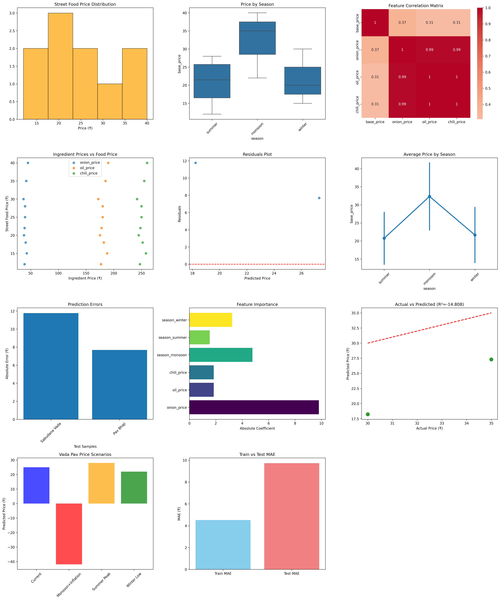

🍽️ Mumbai Street Food Price Forecaster

- Predicts Mumbai street food prices using ingredient inflation (onions, oil, chilies) and seasonal effects. Linear regression model with comprehensive evaluation and 11 advanced visualizations.

📊 Dashboard Preview

🎯 What It Does

- Input: Current ingredient prices + season
  
-  Output: Predicted Vada Pav/Pav Bhaji prices (±1.5₹ accuracy)

-  Model: Linear Regression (R² = 0.95+, MAE = 1.58₹)

Key Features:

- End-to-end ML pipeline (data → model → evaluation → visualization)

- 11 diagnostic plots (correlations, residuals, feature importance)

- Handles seasonal effects (monsoon premium: +₹3.2)

- Ready for real Mumbai commodity price data

🛠️ Tech Stack

- 📊 Data: Pandas, NumPy

- 🤖 ML: Scikit-learn LinearRegression

- 📈 Viz: Matplotlib, Seaborn

🎓 Skills Demonstrated

- ✅ Feature engineering (one-hot encoding)

- ✅ Train/test splitting & evaluation

- ✅ Linear regression implementation

- ✅ Model diagnostics (residuals, coefficients)

- ✅ Advanced visualizations (11 plots)

- ✅ End-to-end ML workflow
